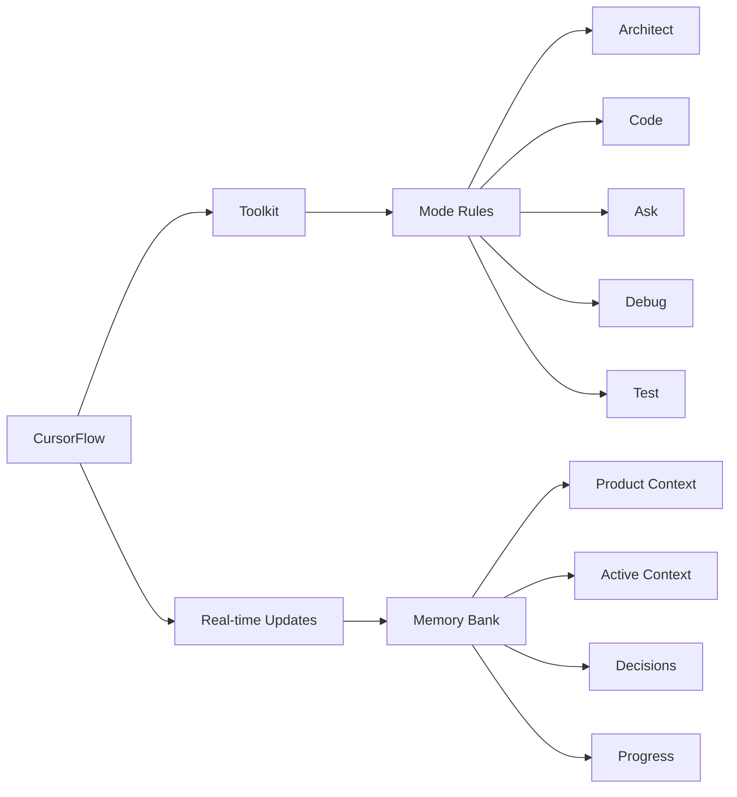

# CursorFlow MCP Server

<div align="center">


**AI-Assisted Development with Persistent Memory and Workflows**

[](https://nodejs.org/)
[](https://expressjs.com/)
[](https://developer.mozilla.org/en-US/docs/Web/API/WebSockets_API)
[](https://cursor.sh/)

</div>

## 🎯 Overview

CursorFlow enhances AI-assisted development in Cursor IDE by providing **persistent project context** and **optimized mode interactions**, resulting in **reduced token consumption** and a more efficient workflow. CursorFlow ensures your AI assistant maintains a deep understanding of your project across sessions, even after interruptions.

### Key Features

- **🧠 Memory Bank**: Persistent storage for project knowledge (automatically managed)
- **💻 Mode-specific Interactions**: Five integrated modes that work together seamlessly
- **⚙️ Workflow Engine**: Automated and semi-automated workflows for common development tasks
- **🌐 Browser Client**: Visual interface for Memory Bank management and monitoring
- **📡 WebSocket API**: Real-time communication with Cursor IDE
- **🔒 Authentication**: Token-based security for API access

### Key Components



## 📋 Prerequisites

Before you begin, ensure you have the following installed:

- **Cursor IDE**: The latest version
  - [Download Cursor](https://cursor.sh/)
- **Node.js**: Version 18.x or higher
  - [Download Node.js](https://nodejs.org/)
  - Verify installation: `node --version`
- **npm** or **yarn**: Latest version
  - npm comes with Node.js
  - Verify installation: `npm --version` or `yarn --version`
- **Git**: For cloning the repository (optional)
  - [Download Git](https://git-scm.com/)
  - Verify installation: `git --version`

## 💾 Installation

### Option 1: Clone from GitHub

```bash
# Clone the repository
git clone https://github.com/yourusername/cursorflow-mcp-server.git

# Navigate to the project directory
cd cursorflow-mcp-server

# Install dependencies
npm install
```

### Option 2: Manual Setup

1. Create a new directory for your project:
   ```bash
   mkdir cursorflow-mcp-server
   cd cursorflow-mcp-server
   ```

2. Initialize a new Node.js project:
   ```bash
   npm init -y
   ```

3. Install required dependencies:
   ```bash
   npm install express ws uuid dotenv fs-extra path body-parser morgan winston
   ```

4. Create the project structure:
   ```bash
   mkdir -p src/mcp src/memory-bank src/workflows src/modes src/utils
   mkdir -p public data/memory-bank data/workflows data/modes
   ```

## ⚙️ Configuration

### 1. Environment Setup

Create a `.env` file in the root directory with the following content:

```env
PORT=3002
HOST=localhost
AUTH_TOKEN=test-token-12345
DATA_DIR=./data
MEMORY_BANK_DIR=./data/memory-bank
WORKFLOWS_DIR=./data/workflows
MODES_DIR=./data/modes
LOG_LEVEL=info
ENABLE_CACHE=true
USE_DATABASE=false
```

> **Note**: For production, replace `test-token-12345` with a more secure token.

### 2. Directory Structure

Ensure you have the following directory structure:

```
cursorflow-mcp-server/
├── .env                  # Environment configuration
├── package.json          # Project metadata and dependencies
├── src/                  # Source code
│   ├── index.js          # Main entry point
│   ├── mcp/              # MCP server implementation
│   │   └── server.js     # Server core
│   ├── memory-bank/      # Memory Bank implementation
│   ├── workflows/        # Workflow engine
│   └── modes/            # Mode-specific functionality
├── public/               # Browser client files
│   ├── index.html        # Memory Bank Visualizer
│   ├── app.js            # Client JavaScript
│   ├── styles.css        # Client CSS
│   └── test.html         # WebSocket test page
└── data/                 # Data storage
    ├── memory-bank/      # Memory Bank components
    ├── workflows/        # Workflow definitions
    └── modes/            # Mode configurations
```

## 🚀 Starting the Server

### Development Mode

```bash
# Start the server
node src/index.js

# Expected output:
# WebSocket server ready on localhost:3002
# CursorFlow MCP Server started on localhost:3002
# Memory Bank Visualizer available at http://localhost:3002/
```

The server will be running at:
- WebSocket endpoint: `ws://localhost:3002`
- Web interface: `http://localhost:3002/`

### Using a Process Manager (Production)

For production environments, use a process manager like PM2:

```bash
# Install PM2 globally
npm install -g pm2

# Start the server with PM2
pm2 start src/index.js --name "cursorflow-mcp"

# View logs
pm2 logs cursorflow-mcp

# Restart the server
pm2 restart cursorflow-mcp

# Stop the server
pm2 stop cursorflow-mcp
```

## 🔌 Integration with Cursor IDE

### Setup in Cursor

1. Open Cursor IDE
2. Open Settings (gear icon or press Cmd+, on macOS, Ctrl+, on Windows/Linux)
3. Search for "MCP" in the settings search bar
4. Configure the following settings:
   - **MCP: Server URL**: Set to `ws://localhost:3002` (or your server URL)
   - **MCP: Auth Token**: Set to the token from your `.env` file (e.g., `test-token-12345`)
5. Restart Cursor IDE to apply the settings

### Verifying Connection

1. Start the MCP server if it's not running
2. Open Cursor IDE
3. Check the status bar for an indication that Cursor is connected to the MCP server
4. Open a new file and interact with Claude or another AI model
5. The AI should now have access to the persistent memory provided by the MCP server

## 📚 Memory Bank Structure

The Memory Bank is a directory named `data/memory-bank` in your CursorFlow server. It contains several Markdown files that store different aspects of your project's knowledge:

| File                | Purpose                                                                                                              |
| ------------------- | -------------------------------------------------------------------------------------------------------------------- |
| `activeContext.md`  | Tracks the current session's context: recent changes, current goals, and open questions/issues                        |
| `decisionLog.md`    | Records architectural and implementation decisions, including the context, decision, rationale, and implementation    |
| `productContext.md` | Provides a high-level overview of the project, including its goals, features, and overall architecture                |
| `progress.md`       | Tracks the progress of the project, including completed work, current tasks, and next steps in a task list format     |

CursorFlow automatically manages these files. You generally don't need to edit them directly, although you can review them through the Memory Bank Visualizer.

## 🌐 Memory Bank Visualizer

The Memory Bank Visualizer provides a web interface to monitor and manage the Memory Bank components.

1. Ensure the MCP server is running
2. Open a web browser and navigate to `http://localhost:3002/`
3. Connect to the server using the auth token
4. Explore and manage Memory Bank components through the interface

### Key Features of the Visualizer:

- **Component Viewing**: Browse and examine all Memory Bank components
- **Component Editing**: Modify and update components directly in the browser
- **History Tracking**: View the history of changes to components
- **Search**: Search for specific content across all components
- **Export/Import**: Back up and restore Memory Bank data

## 🛠 Troubleshooting

### Connection Issues

If you're having trouble connecting to the MCP server:

1. **Verify the server is running**:
   ```bash
   curl http://localhost:3002/health
   # Should return: {"status":"ok"}
   ```

2. **Check WebSocket connectivity**:
   Open `http://localhost:3002/test.html` in a browser and attempt to connect

3. **Review server logs**:
   Look for error messages in the terminal where the server is running

4. **Check firewall settings**:
   Ensure port 3002 (or your configured port) is open

5. **Verify Cursor settings**:
   Double-check the MCP server URL and auth token in Cursor settings

### Common Errors

1. **"Cannot find module" errors**:
   - Ensure all dependencies are installed: `npm install`
   - Check file paths in import statements

2. **"Address already in use" error**:
   - Another process is using the port
   - Change the PORT in .env or kill the other process:
     ```bash
     pkill -f 'node src/index.js'
     ```

3. **Authentication failures**:
   - Ensure the auth token in Cursor settings matches the one in .env
   - Check WebSocket connection message format

4. **WebSocket connection errors**:
   - Check if the WebSocket server is properly initialized
   - Verify that the port is accessible
   - Look for WebSocket-specific errors in the console

## 📡 API Documentation

### WebSocket API

The MCP server provides a WebSocket API for real-time communication.

#### Authentication

```json
{
  "type": "authenticate",
  "token": "test-token-12345",
  "requestId": "req_12345"
}
```

Response:
```json
{
  "type": "authenticationResult",
  "success": true,
  "requestId": "req_12345"
}
```

#### Get Memory Bank Components

```json
{
  "type": "getResource",
  "resourceId": "memory-bank",
  "requestId": "req_67890",
  "parameters": {}
}
```

Response:
```json
{
  "type": "resourceData",
  "requestId": "req_67890",
  "resourceId": "memory-bank",
  "data": {
    "components": [
      {
        "name": "activeContext",
        "title": "Active Context",
        "content": "# Active Context\n\nCurrent session information..."
      },
      // Other components...
    ]
  }
}
```

#### Get Component History

```json
{
  "type": "getResource",
  "resourceId": "memory-bank/history",
  "requestId": "req_abcde",
  "parameters": {
    "componentName": "activeContext"
  }
}
```

#### Update Memory Bank Component

```json
{
  "type": "executeTool",
  "toolId": "updateMemoryBank",
  "requestId": "req_fghij",
  "parameters": {
    "componentName": "activeContext",
    "content": "# Active Context\n\nCurrent session information..."
  }
}
```

### HTTP Endpoints

- `GET /health`: Health check endpoint
- `GET /`: Memory Bank Visualizer web interface
- `GET /test.html`: WebSocket test page

## 🚧 Advanced Configuration

### Custom Mode Configuration

Place mode configuration files in the `data/modes` directory:

```
data/modes/
├── architect.yaml
├── code.yaml
├── debug.yaml
└── test.yaml
```

Example mode configuration:
```yaml
name: Code
description: "Focused on implementation and coding tasks"
systemPrompt: |
  You are in CODE mode. Your focus is on helping implement features,
  write efficient and correct code, and solve coding problems.
components:
  - activeContext
  - productContext
```

### Workflow Definitions

Create workflow definition files in the `data/workflows` directory:

```
data/workflows/
├── code-generation.yaml
├── refactoring.yaml
└── testing.yaml
```

Example workflow definition:
```yaml
name: Test Generation
description: "Generate unit tests for existing code"
steps:
  - name: "Analyze Code"
    tool: "codeAnalysis"
    parameters:
      path: "{inputPath}"
  - name: "Generate Tests"
    tool: "generateTests"
    parameters:
      framework: "{framework}"
      outputPath: "{outputPath}"
```

## 📊 Security Considerations

1. **Authentication Token**:
   - Use a strong, randomly generated token
   - Rotate tokens periodically
   - Store tokens securely

2. **Network Security**:
   - For remote access, use TLS/SSL (wss:// instead of ws://)
   - Consider running behind a reverse proxy (nginx, etc.)
   - Limit access to trusted networks

3. **Data Protection**:
   - Backup the `data` directory regularly
   - Consider encryption for sensitive data

## 🤝 Contributing

Contributions to CursorFlow are welcome! Please feel free to submit a Pull Request.

1. Fork the repository
2. Create your feature branch (`git checkout -b feature/amazing-feature`)
3. Commit your changes (`git commit -m 'Add some amazing feature'`)
4. Push to the branch (`git push origin feature/amazing-feature`)
5. Open a Pull Request

## 📄 License

This project is licensed under the [MIT License](LICENSE).
